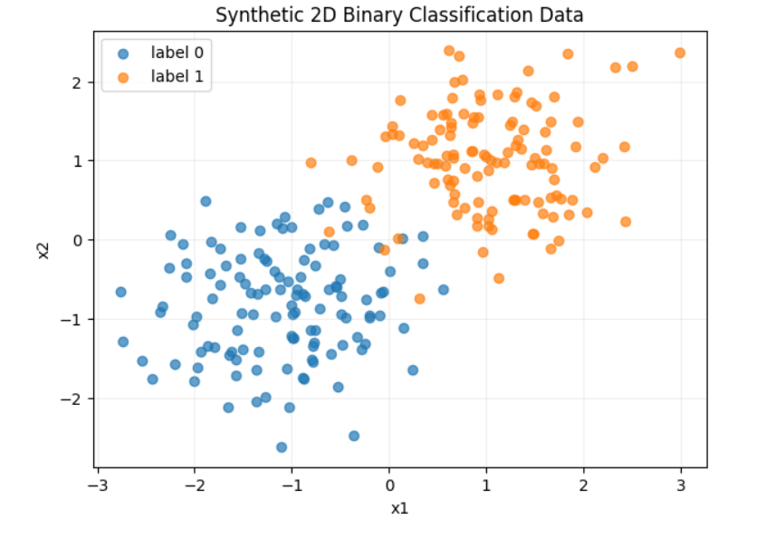
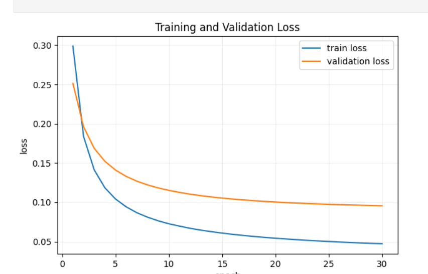
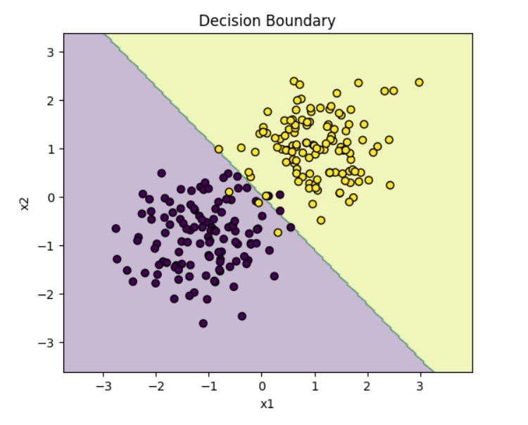

# 第二次课作业

## 作业回答

### 一、二维分类实验结果记录

1. 实验任务与代码说明
   - 使用的二维二分类代码：`classfile/lesson02/lesson02_slides.ipynb` 中的二维二分类实验部分。
   - 实验环境：PyTorch 2.12.1+cpu，随机种子 `SEED = 42`。
   - 实验流程：生成二维二分类数据，划分训练集、验证集和测试集，构造 `TensorDataset` 和 `DataLoader`，定义线性模型，使用 `BCEWithLogitsLoss` 和 `SGD` 训练，并在验证集和测试集上评估。

2. 关键结果展示
   - 二维数据分布

     

   - 训练过程中的 Loss

     

   - 验证集结果

     ```
     最佳验证epoch： 30
     最佳验证loss： 0.0956
     最终test loss： 0.1547
     最终test accuracy： 0.975
     ```

   - 分类边界或最终预测结果

     

### 二、关键代码位置标注

1. 数据处理相关代码
   - 数据生成

     ```python
     # 1. 生成二维二分类数据
     # 设置每个类别的样本数量。
     # 本例包含两个类别，因此最终会生成 120 × 2 = 240 个样本。
     num_per_class = 120

     # 创建一个独立的随机数生成器，并使用 SEED 设置随机种子。
     # 固定随机种子可以保证每次运行代码时生成相同的随机数据，便于实验复现。
     generator = torch.Generator().manual_seed(SEED)

     # 生成类别 0 的样本：
     # 1. torch.randn(num_per_class, 2) 生成 120 个二维标准正态分布样本；
     # 2. 乘以 0.70，控制样本的离散程度；
     # 3. 加上 [-1.0, -1.0]，将样本中心移动到坐标 (-1, -1) 附近。
     class_0 = (
         torch.randn(num_per_class, 2, generator=generator) * 0.70
         + torch.tensor([-1.0, -1.0])
     )

     # 生成类别 1 的样本。
     # 生成方式与类别 0 相同，但样本中心被移动到坐标 (1, 1) 附近。
     class_1 = (
         torch.randn(num_per_class, 2, generator=generator) * 0.70
         + torch.tensor([1.0, 1.0])
     )

     # 沿第 0 维（样本维度）拼接两个类别的特征。
     # 拼接后的 features 形状为 [240, 2]：
     # - 240 表示样本总数；
     # - 2 表示每个样本有两个特征。
     # float() 将数据类型统一转换为 torch.float32。
     features = torch.cat([class_0, class_1], dim=0).float()

     # 为两个类别创建标签：
     # - 类别 0 的 120 个样本对应标签 0；
     # - 类别 1 的 120 个样本对应标签 1。
     # 拼接后的 labels 形状为 [240]。
     # 二分类模型通常使用浮点型标签计算二元交叉熵损失。
     labels = torch.cat(
         [
             torch.zeros(num_per_class),
             torch.ones(num_per_class),
         ],
         dim=0,
     ).float()

     ```


   - 数据集划分

     ```python
     # 将 240 个样本划分为 160 个训练样本、40 个验证样本、40 个测试样本
     indices = torch.randperm(len(features), generator=torch.Generator().manual_seed(SEED))
     train_idx, valid_idx, test_idx = indices[:160], indices[160:200], indices[200:]

     train_x, train_y = features[train_idx], labels[train_idx]
     valid_x, valid_y = features[valid_idx], labels[valid_idx]
     test_x, test_y = features[test_idx], labels[test_idx]
     ```


2. 数据输入相关代码
   - Tensor 构造

     ```python
     # 将 x 特征与 y 标签组合为 TensorDataset，供 PyTorch 的 DataLoader 读取
     train_set = TensorDataset(train_x, train_y)
     valid_set = TensorDataset(valid_x, valid_y)
     test_set = TensorDataset(test_x, test_y)

     ```


   - Batch 构造

     ```python
     # 利用 DataLoader 构造 Batch
     BATCH_SIZE = 16
     train_loader = DataLoader(train_set, BATCH_SIZE, shuffle=True,
                               generator=torch.Generator().manual_seed(SEED))
     valid_loader = DataLoader(valid_set, BATCH_SIZE)
     test_loader = DataLoader(test_set, BATCH_SIZE)
     ```


3. 模型训练相关代码
   - 模型定义

     ```python
     # 定义线性变换模型，并设置权重参数和 bias
     model = nn.Linear(in_features=2, out_features=1)
     with torch.no_grad():
         model.weight.copy_(torch.tensor([[0.4, -0.2]]))
         model.bias.fill_(0.1)
     ```


   - Loss 定义

     ```python
     # 利用 BCEWithLogitsLoss 计算二分类损失
     loss_fn = nn.BCEWithLogitsLoss()
     # 删除第二个维度，从 [16, 1] 变为 [16]
     logits = model(batch_features).squeeze(dim=1)
     loss = loss_fn(logits, batch_labels)
     ```


   - Optimizer 定义

     ```python
     # 一次参数更新演示中使用的优化器
     update_demo = deepcopy(model)
     optimizer = torch.optim.SGD(update_demo.parameters(), lr=0.2)

     # 完整训练中使用的优化器
     model = nn.Linear(2, 1)
     optimizer = torch.optim.SGD(model.parameters(), lr=0.2)
     ```


   - 训练循环

     ```python
     # 一轮训练
     def train_one_epoch(model, data_loader, optimizer):
         model.train()
         total_loss, total_count = 0.0, 0
         for x, y in data_loader:
             optimizer.zero_grad()
             logits = model(x).squeeze(1)
             loss = loss_fn(logits, y)
             loss.backward()
             optimizer.step()
             total_loss += loss.item() * len(y)
             total_count += len(y)
         return total_loss / total_count


     # 完整的多轮训练
     for epoch in range(1, 31):
         train_loss = train_one_epoch(model, train_loader, optimizer)
         valid_loss, valid_acc = evaluate(model, valid_loader)
         history.append({"epoch": epoch, "train_loss": train_loss,
                         "valid_loss": valid_loss, "valid_acc": valid_acc})
         # 保存验证 loss 最低的模型参数
         if valid_loss < best_valid_loss:
             best_valid_loss, best_state = valid_loss, deepcopy(model.state_dict())
         if epoch == 1 or epoch % 5 == 0:
             print(f"Epoch {epoch:02d} | train {train_loss:.4f} | "
                   f"valid {valid_loss:.4f} | acc {valid_acc:.3f}")
     ```


4. 模型评估相关代码
   - 验证过程

     ```python
     # 验证模型
     def evaluate(model, data_loader):
         model.eval()
         total_loss, total_correct, total_count = 0.0, 0, 0
         with torch.no_grad():
             for x, y in data_loader:
                 logits = model(x).squeeze(1)
                 total_loss += loss_fn(logits, y).item() * len(y)
                 predictions = (torch.sigmoid(logits) >= 0.5).float()
                 total_correct += (predictions == y).sum().item()
                 total_count += len(y)
         return total_loss / total_count, total_correct / total_count
     ```


   - 预测过程

     ```python
     best_epoch = int(history.loc[history["valid_loss"].idxmin(), "epoch"])
     # 利用获取到的最佳模型对测试集进行预测
     model.load_state_dict(best_state)
     test_loss, test_acc = evaluate(model, test_loader)
     ```


5. 数据 Shape 标注
   - 关键位置一的数据 Shape

     ```python

     #features 形状为 [240, 2]
     features = torch.cat([class_0, class_1], dim=0).float()

     #labels 形状为 [240]。
     labels = torch.cat(
         [
             torch.zeros(num_per_class),
             torch.ones(num_per_class),
         ],
         dim=0,
     ).float()
     ```


   - 关键位置二的数据 Shape

     ```python
     # 输入的 batch_features 形状为 [16, 2]
     preview_loader = DataLoader(train_set, BATCH_SIZE, shuffle=False)
     batch_features, batch_labels = next(iter(preview_loader))

     ```


   - 关键位置三的数据 Shape

     ```python
     model = nn.Linear(in_features=2, out_features=1)
     with torch.no_grad():
         model.weight.copy_(torch.tensor([[0.4, -0.2]]))
         model.bias.fill_(0.1)
     output = model(batch_features)
     # 得到输出 torch.Size([16, 1])
     print(output.shape)
     # 删除第二个维度，与标签维度一致，shape 为 [16]
     logits = model(batch_features).squeeze(dim=1)
     ```


### 三、核心概念解释

1. Tensor：PyTorch 中用于保存数值数据的多维数组，可以表示特征、标签、模型输出和参数。

2. Batch：一次送入模型进行计算和参数更新的一组样本，本实验中 `BATCH_SIZE = 16`。

3. Epoch：模型完整遍历一次训练集的过程，本实验共训练 30 个 epoch。

4. Logit：模型在经过 Sigmoid 之前输出的原始分数，本实验中用于输入 `BCEWithLogitsLoss`。

5. Loss：衡量模型预测和真实标签之间差距的损失值，用于反向传播和参数优化。

### 四、实验记录补充

1. 我运行了什么

   我运行了 `lesson02_slides.ipynb` 中的二维二分类实验。实验先生成两个二维高斯分布类别，共 240 个样本；然后划分为 160 个训练样本、40 个验证样本和 40 个测试样本；接着构造 `TensorDataset` 和 `DataLoader`，使用线性模型 `nn.Linear(2, 1)` 完成二分类训练；最后绘制数据分布、Loss 曲线和分类边界，并输出验证集和测试集指标。

2. 我得到了什么结果

   数据生成后，`features.shape` 为 `[240, 2]`，`labels.shape` 为 `[240]`。一个 batch 中，`batch_features.shape` 为 `[16, 2]`，`batch_labels.shape` 为 `[16]`。模型输出先是 `[16, 1]`，经过 `squeeze(1)` 后得到 `[16]` 的 `logits`，与标签形状一致。训练 30 个 epoch 后，最佳验证 epoch 为第 30 轮，最佳验证 loss 为 `0.0956`，最终 test loss 为 `0.1547`，最终 test accuracy 为 `0.975`。从 Loss 曲线和分类边界图看，模型已经学到较清晰的二分类边界。

3. 我遇到了什么问题

   我主要遇到了三个问题：第一，模型输出的 shape 是 `[16, 1]`，而标签 shape 是 `[16]`，需要用 `squeeze(1)` 对齐；第二，`update_demo.parameters()` 是一次参数更新演示中的优化器写法，完整训练时应该使用 `model.parameters()`；第三，原来的图片链接是 Typora 本地绝对路径，上传到 GitHub 后无法正常显示。

4. 我尝试了什么

   我通过打印 `features`、`labels`、`batch_features`、`batch_labels`、`logits` 和 `loss` 的 shape 来核对数据流；通过固定随机种子 `SEED = 42` 保证实验可复现；通过验证集 loss 保存 `best_state` 并在测试集上评估最终模型；同时把实验图片复制到 `assignment/assets/`，并把 Markdown 图片链接改为仓库内相对路径。

5. 我如何判断代码已经跑通

   我用运行输出判断代码已经跑通：数据和 batch 的 shape 符合预期；一次参数更新后模型权重发生变化；训练过程中 train loss 和 valid loss 整体下降；最终能输出最佳验证 epoch、验证 loss、test loss 和 test accuracy；分类边界图也能正常绘制，并且能够把两类样本大致分开。

6. 是否使用了 AI/Agent，以及自己核对了哪些内容

   本次文档整理使用了 AI/Agent 辅助补全文档结构、核对 Notebook 输出、修正优化器表述和图片路径。自己核对的内容包括：二维二分类代码是否能对应作业要求，数据集划分是否为 160/40/40，关键 shape 是否与 Notebook 输出一致，`BCEWithLogitsLoss` 和 `SGD` 的使用位置是否正确，最终验证集和测试集指标是否与运行结果一致，以及图片是否改成了 GitHub 可用的相对路径。
